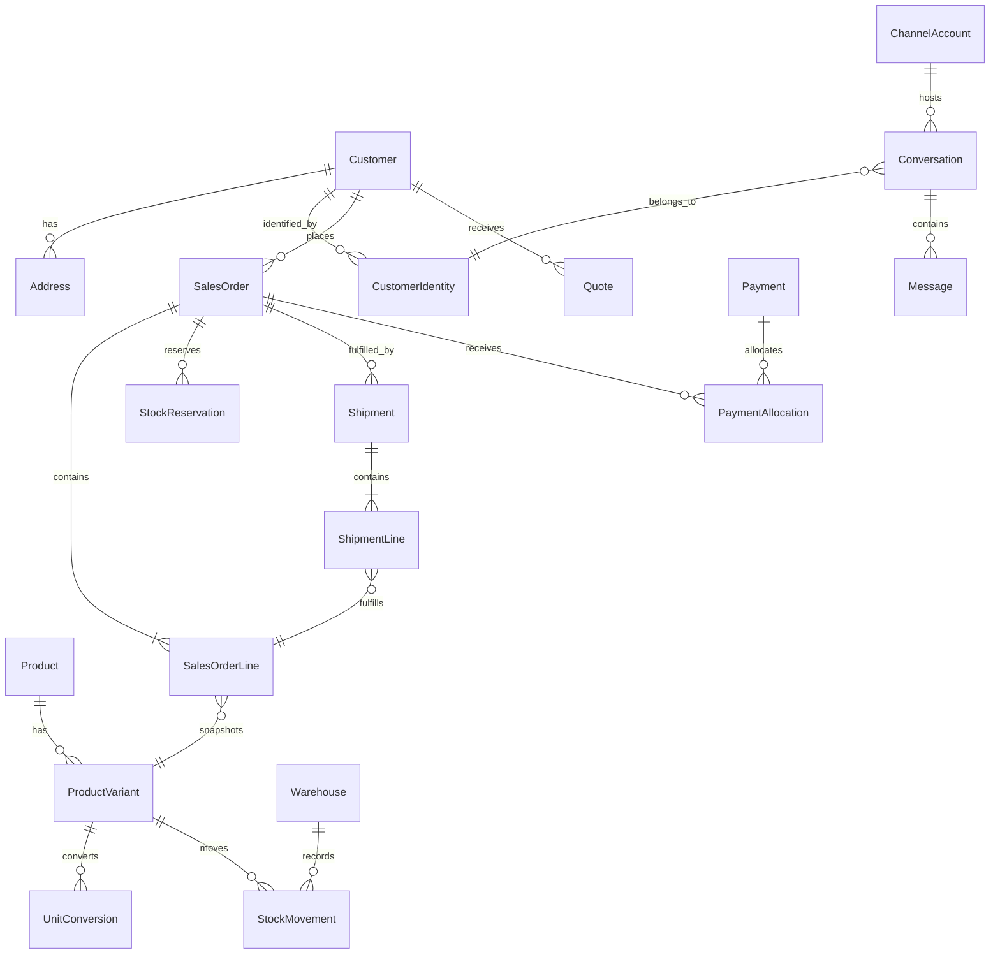

# Mô hình dữ liệu đích ở mức khung

Schema đã được migration tăng dần qua lát cắt 05B. Mỗi đợt chỉ thêm phần cần cho lát cắt đang làm, nhưng khóa và ranh giới module phải phù hợp mô hình đích dưới đây.

## 1. Quy ước chung

- ID nội bộ không mang ý nghĩa nghiệp vụ; mã hiển thị (`order_no`, `sku`) có unique constraint riêng.
- Tất cả bảng nghiệp vụ có `created_at`, `updated_at` theo UTC; chứng từ đã chốt ưu tiên event/adjustment thay vì sửa mất lịch sử.
- Tiền VND là integer/bigint; số lượng và hệ số là Decimal với precision được chốt khi biết ngành hàng.
- Bản ghi thuộc một đơn vị kinh doanh; thiết kế ban đầu chỉ có một đơn vị nhưng không dùng hằng số ngầm trong logic quyền.
- Trường trạng thái dùng enum/constraint và transition service, không cho cập nhật tùy ý.
- PII và credential tách khỏi dữ liệu hiển thị; credential mã hóa và không bao giờ trả về API.

## 2. Quyền sở hữu theo module

| Module       | Sở hữu                                                                                            | Không được tự thay                           |
| ------------ | ------------------------------------------------------------------------------------------------- | -------------------------------------------- |
| Identity     | StaffUser, Role, Permission, Session                                                              | Chứng từ bán/kho/tiền                        |
| Customer     | Customer, ContactPoint, Address, CustomerIdentity, CustomerGroup, Task                            | Snapshot địa chỉ trên đơn cũ                 |
| Catalog      | Product, ProductVariant, UnitConversion, MediaAsset                                               | StockBalance, giá chốt trên đơn              |
| Pricing      | PriceList, PriceRule, CustomerPriceAssignment                                                     | Tổng đơn đã chốt                             |
| Quoting      | Quote, QuoteLine, QuoteRevision                                                                   | Reservation/StockMovement                    |
| Inventory    | Warehouse, StockBalance, StockMovement, StockReservation, StockAdjustment                         | Yêu cầu mua, khoản phải trả                  |
| Purchasing   | Supplier, PurchaseOrder/Line, GoodsReceipt/Line                                                   | Sổ tiền; nhận hàng gọi inventory transaction |
| Ordering     | SalesOrder/Line, OrderEvent                                                                       | Stock ledger và payment ledger trực tiếp     |
| Fulfillment  | Shipment/Line, TrackingEvent, ReturnRequest/Line/Receipt                                          | Tự ghi nhận COD đã về                        |
| Finance      | Payment, PaymentAllocation, Refund, Expense, ReceivableDocument, PayableDocument, SettlementEntry | Sửa dòng đơn/kho để khớp số                  |
| Messaging    | ChannelAccount, Conversation, Message, Assignment                                                 | Tự xác nhận đơn từ nội dung chat             |
| Integration  | ChannelListing, ExternalOrderLink, WebhookEvent, SyncJob, OutboxEvent, IntegrationCredential      | Logic nghiệp vụ bản sao                      |
| Customer web | CustomerAccount, OtpChallenge, Cart                                                               | Cấp nhóm sỉ/nợ từ đăng ký                    |
| Marketing/AI | Campaign, ContentItem, ConsentRecord, KnowledgeDocument, AiRun/Suggestion/Feedback                | Tạo tiền/kho không qua API nghiệp vụ         |

## 3. Quan hệ trung tâm

## 4. Aggregate và khóa cạnh tranh

### Inventory aggregate

- Khóa logic: `business_id + warehouse_id + variant_id`.
- `StockMovement` là sổ; `StockBalance` là projection/tổng hợp có version để cập nhật optimistic hoặc row lock trong transaction.
- `StockReservation` gắn nguồn (`SALES_ORDER`) và source id/line id; unique chống giữ hai lần.
- Xác nhận và xuất đơn phải khóa đúng các balance theo thứ tự ổn định để tránh deadlock.

### Sales order aggregate

- Header lưu khách, nguồn, currency, snapshot địa chỉ, tổng do backend tính và ba nhóm trạng thái: vòng đời, giao, thanh toán.
- Line lưu SKU/name/UOM/conversion/price/discount snapshots và số đặt/giao/trả.
- `OrderEvent` lưu transition và idempotency key; sửa sau chốt qua command có version.

### Payment aggregate

- `Payment` là khoản tiền thực nhận/chi với external reference unique theo provider/account.
- `PaymentAllocation` phân bổ tới receivable/order; tổng allocation không vượt payment.
- Phần chưa phân bổ là tiền khách trả trước/trả thừa, không phải nợ âm.

## 5. Unique và constraint dự kiến

| Dữ liệu                | Constraint tối thiểu                                                 |
| ---------------------- | -------------------------------------------------------------------- |
| SKU                    | unique trong đơn vị kinh doanh, so sánh theo chuẩn đã chốt           |
| Định danh kênh         | unique `(channel_account_id, external_user_id)`                      |
| Sự kiện ngoài          | unique `(channel_account_id, external_event_id)`                     |
| Đơn ngoài              | unique `(channel_account_id/shop_id, external_order_id)`             |
| Idempotency API        | unique `(actor/client, operation, idempotency_key)` với request hash |
| Reservation nguồn      | unique `(source_type, source_line_id, active version)`               |
| Mã thanh toán provider | unique `(provider_account_id, external_transaction_id)`              |
| Quy đổi                | hệ số > 0; một base unit/SKU; version không chồng hiệu lực           |
| Số lượng chứng từ      | >= 0; transition kiểm tra giới hạn theo nghiệp vụ                    |

## 6. Projection và đối chiếu

`StockBalance`, số phải thu và dashboard là projection để đọc nhanh, không thay sổ. Cần job/báo cáo đối chiếu:

- Tổng stock movements theo SKU/kho với balance.
- Tổng receivable documents, allocations, credit adjustments với số còn phải thu.
- Tổng shipment/return lines với số đã giao/đã trả trên order line.
- Tổng payment với allocations/refunds và phần chưa phân bổ.

Sai lệch tạo cảnh báo và quy trình sửa có chứng từ; không “fix” bằng update trực tiếp.

## 7. Migration theo đợt

- Đợt 01: business, staff identity, role/permission/session, audit.
- Đợt 02: customer/contact/address/group/task.
- Migration Đợt 02 đã triển khai `Customer`, `ContactPoint`, `Address`, `CustomerGroup`, `CustomerTask` và `SalesOpportunity`; trùng liên hệ được phép giữa các customer để chỉ gợi ý, không tự gộp.
- Đợt 03: product/variant/unit conversion/media metadata.
- Migration Đợt 03 đã triển khai `Product`, `ProductVariant`, `UnitConversion` và `MediaAsset`; SKU/barcode có unique theo business, factor có check dương, mọi trạng thái dùng ngừng bán/lưu trữ thay cho xóa.
- Migration Đợt 04A đã triển khai `Supplier`, `PurchaseOrder`, `PurchaseOrderLine`; dòng đơn mua snapshot SKU/đơn vị/hệ số/số lượng cơ sở, có DB check dương và không có quan hệ nào tự ghi tồn.
- Migration Đợt 04B đã triển khai `Warehouse`, `GoodsReceipt/Line`, `StockBalance`, `StockMovement`; phiếu nhận có request hash/idempotency key, dòng snapshot và DB check không âm/dương theo bất biến.
- Migration Đợt 04C-A đã triển khai `OpeningStock` với snapshot SKU/tên/đơn vị, giá trị, thời điểm, người tạo, request hash/idempotency key và unique theo business/kho/SKU. `StockMovement` nhận nguồn `OPENING_STOCK`; chứng từ, balance và movement được ghi trong một transaction Serializable. Migration snapshot tiếp nối có backfill trước khi đặt NOT NULL.
- Migration Đợt 04C-B thêm `StockAdjustment` một SKU/chứng từ, trạng thái `POSTED`, lưu tồn hệ thống, số đếm, chênh lệch, lý do, người tạo, snapshot danh mục, request hash/idempotency key và thông tin định giá. `StockMovement` nhận nguồn `STOCK_ADJUSTMENT` và chênh lệch có dấu. Balance, chứng từ, movement và audit đổi cùng một transaction; `version` chặn kiểm đếm cũ.
- Migration Đợt 05A thêm `PriceTier` lưu giá admin theo business/SKU/bậc số lượng, số VND nguyên, version và unique `(business_id, variant_id, quantity_from)`. `PriceTierCommand` lưu idempotency key, request hash và response của lệnh ghi giá để retry an toàn. Phần mở rộng 05A thêm đơn vị bán cố định, giá lẻ và resolver lượng Decimal. Giá bậc trống không tự sinh giá.
- Cập nhật 05A: `ProductVariant` có `sellingUnitCode`, `sellingUnitName`, `sellingUnitFactor` cố định; migration cũ backfill đơn vị gốc. `PriceTier.quantityFrom=1` biểu thị giá lẻ; các bậc sỉ giữ mốc 5, 10, 15...; số lượng giao dịch được nhận dưới dạng Decimal tối đa 6 chữ số lẻ.
- Đợt 05B thêm `Quote`, `QuoteLine`, `QuoteRevision`, `QuoteCommand`: draft lưu snapshot sản phẩm/đơn vị/giá admin theo SKU, giảm dòng/toàn báo giá, phí giao, thuế theo phần trăm hoặc VND, cọc dự kiến, tổng VND, ghi chú thanh toán và version. Lệnh ghi chống trùng bằng request hash; cập nhật nháp dùng optimistic version. Revision lưu JSON snapshot bất biến cùng sent/received/expiry UTC; 72 giờ tính từ lúc khách nhận. Chọn một cách thuế mỗi báo giá; tạm tính phần trăm trên tiền hàng sau giảm cộng phí giao, không gồm cọc; cần xác nhận trước vận hành thật. Chuyển thành đơn nháp thuộc 05C chưa triển khai.
- Đợt 06: sales order/event, reservation, shipment.
- Đợt 07–08: payment/allocation/receivable/expense, return and reporting projections.
- Chỉ thêm integration/AI/customer-web entities khi bắt đầu đúng đợt tương ứng.
